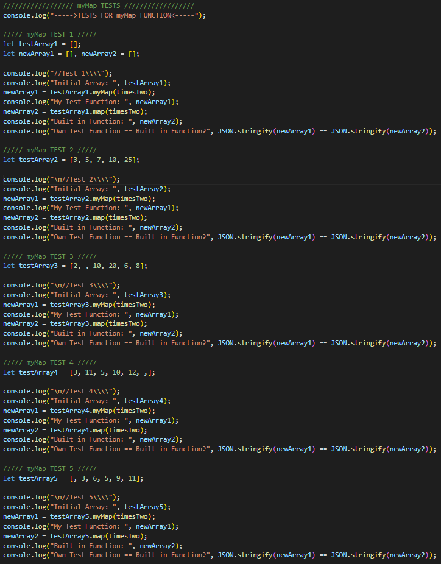
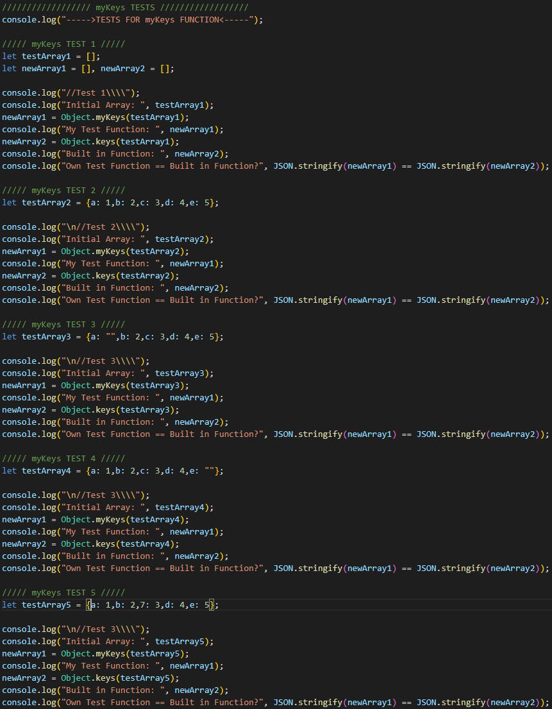
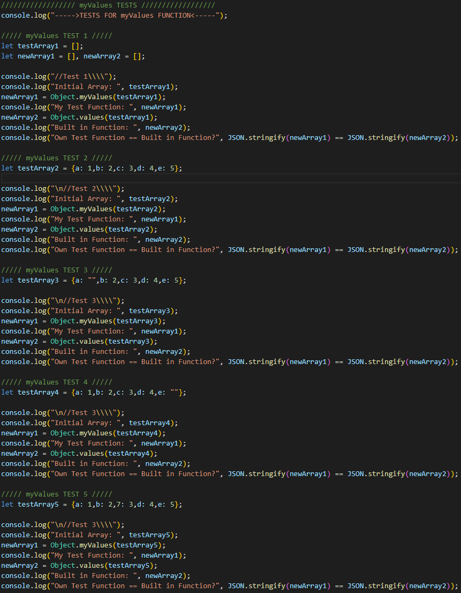

# Assignment 2 - JavaScript Methods
Starter template code for Assignment 2 - JavaScript Methods. 

## Table of Contents

1. [Group Members](#Group-Members)
2. [Overview](#Overview)
3. [Product Spec](#Product-Spec)
4. [Tests](#Tests)
5. [Grading](#Grading)

## Group Members

1. Wei Da Chen - [chenweida6220](https://github.com/chenweida6220)
2. Tommy Liang - [TommyLiang1](https://github.com/TommyLiang1)
3. Kevin Hardyal - [kevinville](https://github.com/kevinville)
4. Stephanie Kim - [steph-kimm](https://github.com/steph-kimm)

## Overview

**Goal**

To improve your understanding of JavaScript syntax, functions, and higher-order functions, in addition to a better understanding of JavaScript and Array methods. 

## Product Spec

**Required**

Consider the following *native* JavaScript methods:
  1. map()
  2. filter()
  3. some()
  4. every()
  5. reduce()
  6. includes()
  7. indexOf()
  8. lastIndexOf()
  9. Object.keys()
  10. Object.values()

In this assignment, you will re-create these methods using JavaScript functions. For example, you will create your own "myMap" method corresponding to the native "map" method (see list below).

Make sure to carefully understand what each native method is designed to do, and DO NOT use any of the respective native JavaScript methods to implement your solutions. However, if applicable, you can re-use your own methods after you have created them. 

Strongly suggested: Use Mozilla Developer Network (MDN) Web Docs linked above to understand how each native JavaScript method works. Pay attention to what arguments they take as well as the return value.  

**JavaScript Prototype: Method**

Every object in JavaScript has a built-in property called "prototype." 

The prototype constructor is used to add new methods (functions) and properties to a JavaScript object. 
- If a method is constructed, then it will be available for the object. 
- If a property is constructed, then the object will be given the property and its value, as default.

In this Assignment, we use the prototype constructor to add new methods to the Array() object.
 
## Tests
1. [myMap](#myMap)
2. [myFilter](#myFilter)
3. [mySome](#mySome)
4. [myEvery](#myEvery)
5. [myReduce](#myReduce)
6. [myIncludes](#myIncludes)
7. [myIndexOf](#myIndexOf)
8. [myLastIndexOf](#myLastIndexOf)
9. [myKeys](#myKeys)
10. [myValues](#myValues)

### myMap

### Filter

### mySome

### myReduce

### myIncludes

### myIndexOf

### myLastIndexOf

### myKeys

### myValues

## Grading 
- 7% - Assignment functionality
- 3% - Git version control, continuing the use of feature branch worlflows. Create a feature branch for each function being implemented.